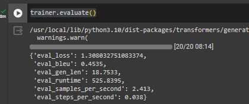
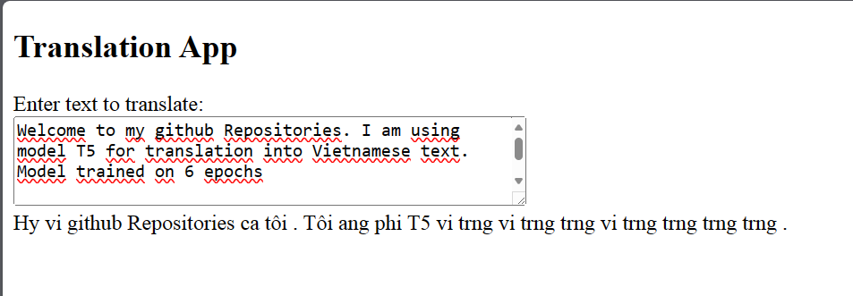

# Machine-translation-English-to-Vietnamese

## Huggingface: T5 Model

```
git clone https://github.com/hotonbao/Machine-translation-English-to-Vietnamese.git

cd Machine-translation-English-to-Vietnamese

```

**Open file: translateMachine-en2vi-T5.ipynb to train model**

Evaluate model



Run Django server with:

```
python manage.py runserver
```

Open browser and run url below:

```
http://127.0.0.1:8000/translate/
```

Type any test and press enter:


# Summary: 
### You should train many epochs to increase bleu. I only train with a few epochs to check model availability